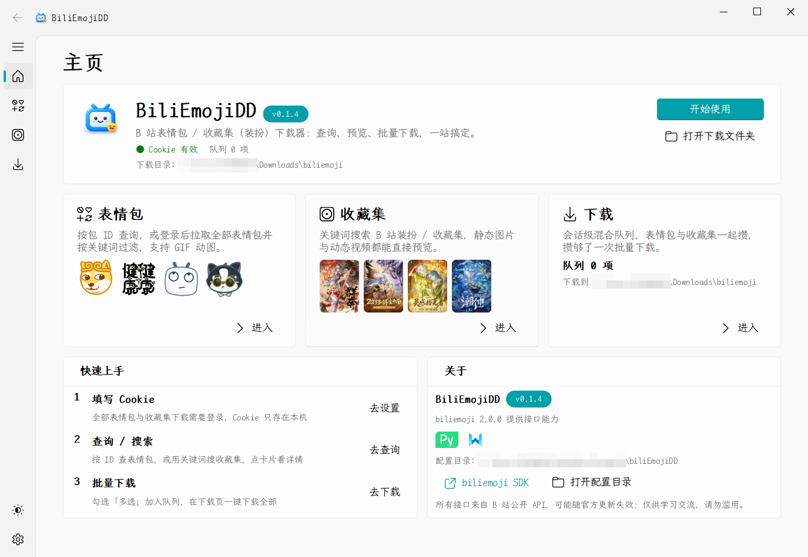

<p align="center">
  
</p>

<h1 align="center">biliEmojiDD</h1>

<p align="center">
  <b>B 站表情包 / 收藏集（装扮）下载器</b><br>
  <sub>Windows 桌面应用</sub>
</p>
<p align="center">
  <a href="https://github.com/ldm0715/BiliEmojiDD/releases/latest"></a>
  <a href="LICENSE"></a>
  
  
  
</p>

查找、预览、批量下载 B 站的表情包与收藏集（装扮）——不用再对着接口文档手写脚本。
五个页面覆盖完整流程：按包 ID 查表情包、登录后拉取全部表情包、按房间号取直播间专属表情、
关键词搜收藏集并在页面里直接播放动态视频、最后在下载队列里统一管理。

## 截图

<p align="center">
  
</p>

## 功能

| 页面 | 做什么 |
|---|---|
| **主页** | 启动默认页。Cookie 状态灯、队列数量、下载目录一眼可见，三张入口卡直达各页 |
| **表情包** | 全部表情包（登录后拉取，关键词本地过滤）／ 按包 ID 查询 ／ **直播间专属表情**。网格预览，点开看大图，GIF 悬浮自动播放 |
| **收藏集** | 关键词搜索装扮与收藏集，详情页分「静态图片 / 动态视频」两个标签，**视频直接在页面里播放** |
| **下载** | 会话级混合队列（表情包 + 收藏集 + 直播间表情），全选 / 批量下载 / 逐项进度与结果统计 |
| **设置** | 扫码登录、下载目录、代理、下载线程数、缓存上限、主题（浅色 / 深色 / 跟随系统）、字体渲染 |

几个值得一提的：

- **扫码登录**——用手机 B 站客户端扫一下就有 Cookie，不必再去浏览器的开发者工具里翻
- **右键复制表情**——表情详情网格右键直接放上剪切板，动图保留动画，不必先下载再翻文件夹
- **内置更新**——检查新版本、渲染更新说明、一键下载安装；GitHub 直连慢可用加速镜像，
  也能自己添加源并测速排序，安装包一律做 SHA-256 校验
- **缓存与历史**——缩略图与接口响应落盘复用，重启后仍命中；搜索历史浮层最多记 10 条

## 安装

到 [Releases](https://github.com/ldm0715/BiliEmojiDD/releases/latest) 下载：

| 文件 | 说明 |
|---|---|
| `BiliEmojiDD-Setup-<版本>.exe` | 安装包。装到当前用户目录，**不需要管理员权限** |
| `BiliEmojiDD-<版本>-win64.zip` | 便携版，解压即用 |
| `SHA256SUMS.txt` | 上面两个文件的 SHA-256 校验和 |

卸载时默认**保留** `%APPDATA%\biliEmojiDD`（配置、缓存、搜索历史），会先问你要不要一并删除。

## 从源码运行

需要 **Windows 10 或更高版本**、**Python 3.11** 与 [uv](https://docs.astral.sh/uv/)。

```bash
uv sync
uv run python main.py
```

> Python 锁在 3.11：界面库用的是 [`PySide6-Fluent-Widgets`](https://github.com/ldm0715/PyQt-Fluent-Widgets)
> 的 PySide6 分支，它要求 `PySide6<=6.4.2`，而 6.4.2 没有 3.12 的 wheel。

## 使用须知

### Cookie

「全部表情包」与「收藏集下载」需要登录。「设置 → 账号」里点「扫码登录」，用手机 B 站客户端
扫码即可；扫不成也可以手动粘贴。Cookie 会过期，失效后主页状态灯会变红，重新扫一次就好。

Cookie 只保存在本机 `%APPDATA%/biliEmojiDD/config.json`，**不会上传到任何地方**。

### 下载位置

内容保存到 `下载目录/<表情包名>/` 或 `下载目录/<收藏集名>/`，下载目录在设置页可改。

### 免责声明

- 所有接口均来自 B 站**公开 API**，可能随官方更新失效
- 仅供学习交流，请勿滥用，后果自负

## 常见问题

<details>
<summary>提示需要登录 / 表情包列表拉不出来？</summary>

「全部表情包」和「收藏集下载」都要 Cookie。到「设置 → 账号」扫码登录，或手动粘贴形如
`SESSDATA=...; bili_jct=...` 的串。Cookie 失效后主页状态灯会变红提示你换一个。
</details>

<details>
<summary>检查更新一直转圈 / 下载安装包很慢？</summary>

检查更新走 GitHub，国内直连常常不通。到「设置 → 关于 → 下载加速」选一个镜像，或点「测速」
挑最快的那个；也能自己加源并拖动排序。
</details>

<details>
<summary>下载的文件在哪？缓存占多大？</summary>

下载内容在设置页指定的「下载目录」下，按表情包 / 收藏集名称分文件夹。缩略图与接口响应
缓存在 `%APPDATA%/biliEmojiDD/cache/`，容量上限可在设置页调整，也能一键清除。
</details>

## 文档

- [使用指南](docs/usage.md)——页面功能、Cookie 获取、缓存、常见问题
- [架构设计](docs/architecture.md)——技术栈、模块分层、线程模型、数据流
- [开发与维护](docs/development.md)——环境、命令、代码约定、关键坑点
- [检查更新与打包发布](docs/update_and_packaging.md)——版本号维护、发版流程、Nuitka + NSIS 打包

按功能分类的全部文档见 [docs/README.md](docs/README.md)，版本变更见 [CHANGES.md](CHANGES.md)。

## 许可与致谢

本项目以 **[GPL-3.0-or-later](LICENSE)** 发布，Copyright (C) 2026 gcnanmu。

站在这些项目肩上：

| 依赖 | 许可 | 用途 |
|---|---|---|
| [PySide6](https://doc.qt.io/qtforpython/) | LGPLv3 | Qt 绑定 |
| [PySide6-Fluent-Widgets](https://github.com/zhiyiYo/PyQt-Fluent-Widgets)（[PySide6 分支](https://github.com/ldm0715/PyQt-Fluent-Widgets)） | GPLv3，**仅限非商业用途** | Fluent 界面组件 |
| [LXGW WenKai Mono GB](https://github.com/lxgw/LxgwWenKai) | SIL OFL 1.1 | 内置字体 |
